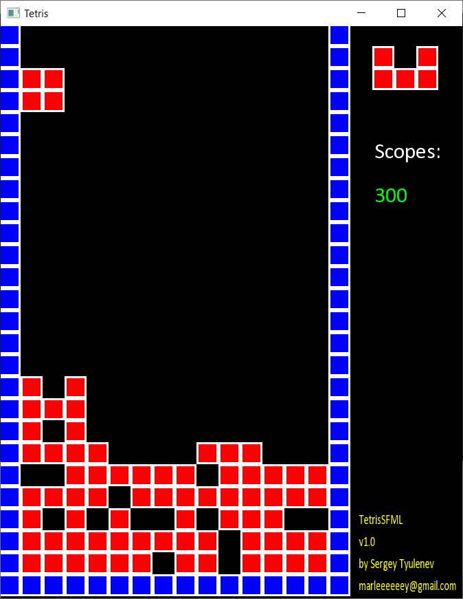
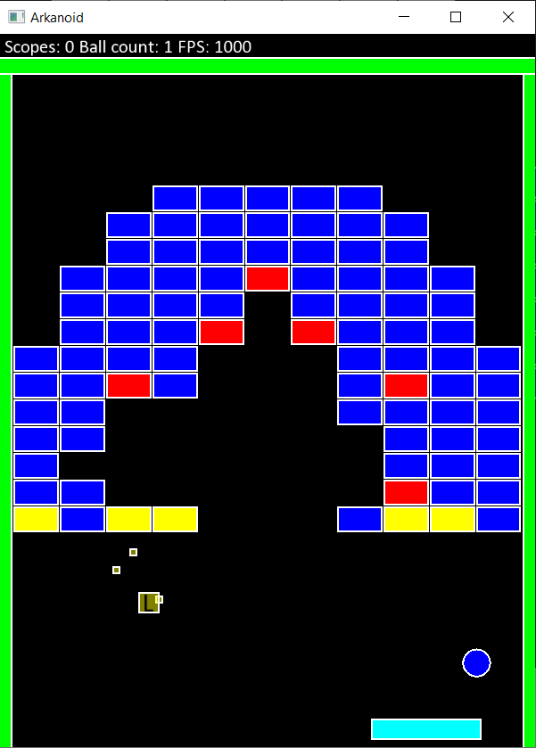

# My Releases

## Tetris

[Tetris-1.1.0-win64.exe](MyReleases/Tetris-1.1.0-win64.exe) 

[Tetris source code](https://github.com/marleeeeeey/Cpp/tree/master/time/2019-11-10_0057_TetrisSFML/TetrisSFML)

## Arkanoid

[Arkanoid-0.9.1-win64.exe](MyReleases/Arkanoid-0.9.1-win64.exe) 

[Arkanoid source code](https://github.com/marleeeeeey/Cpp/tree/master/time/2019-11-23_0032_ArkanoidSFML/ArkanoidSFML)

## Anki Deck Generator

// TODO

утилита на Python для автоматического создания карточек повторения иностранных слов для платформы [ANKI](https://apps.ankiweb.net/). По набору слов с контекстом или без находит значение, перевод (Google Translate API), картинку (Google Image API) и произношение (Google Speech API). На выходе программы колода карт для повторения в формате *.apkg.

## Image loader

// TODO